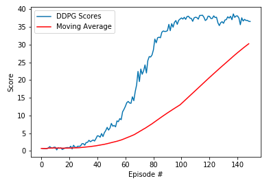

### Udacity Deep Reinforcement Learning Nanodegree (DRLND) - Project 2 - Continuous Control

# Report

See the `readme.md` for background information for the project and how to set up the Unity ML-Agents Reacher environment used. This report contains detail of the **Actor-Critic** learning algorithm and model architecture used to solve the environment, and results of experimentation with the architecture.

## 1. The Learning algorithm 

### Reinforcement Learning Summary
<div>
 
</div>

*The agent-environment interaction in reinforcement learning. (Source: Sutton and Barto, 2017)*

- The reinforcement learning (RL) framework is characterized by an **agent** learning to interact with its **environment**.
- At each time step, the agent receives the environment's **state** (_the environment presents a situation to the agent_), and the agent must choose an appropriate **action** in response. One time step later, the agent receives a **reward** (_the environment indicates whether the agent has responded appropriately to the state_) and a new **state**.
- All agents have the goal to maximize expected cumulative reward, or the expected sum of rewards attained over all time steps.

<div id="over">
    <span class="Centerer"></span>
    
</div>

### Actor-Critic Summary

A high level explanation - the **Actor** in an actor-critic model does its best to respond to the environment in order to maximize its reward   
<div>
 
</div>

The **Critic** repsonds immediately with feedback on how well the actor is doing
<div>
 
</div>

----

In somewhat more detail:

Basic reinforcement learning models are either **Value based** or **Policy based**. The following are excerpts from a [freeCodeCamp](https://www.freecodecamp.org/news/an-intro-to-advantage-actor-critic-methods-lets-play-sonic-the-hedgehog-86d6240171d/) article about this :
- Value based methods (Q-learning, Deep Q-learning): where we learn a value function that will map each state action pair to a value. Thanks to these methods, we find the best action to take for each state — the action with the biggest value. This works well when you have a finite set of actions.
- Policy based methods (REINFORCE with Policy Gradients): where we directly optimize the policy without using a value function. This is useful when the action space is continuous or stochastic. The main problem is finding a good score function to compute how good a policy is. We use total rewards of the episode.

Actor-Critic is a hybrid of these, using two neural networks:
- an Actor that controls how our agent behaves (policy-based)
- a Critic that measures how good the action taken is (value-based)

The Actor-Critic model differs from more elementary learning processes in that instead of waiting until the end of the episode as in Monte Carlo REINFORCE, an update is made at each time step (TD Learning): 
<div>
 
</div>

Because we do an update at each time step, we can’t use the total rewards `R(t)`. Instead, we need to train a Critic model that approximates the value function (the value function calculates what is the maximum expected future reward given a state and an action). This value function replaces the reward function in policy gradient that calculates the rewards only at the end of the episode.

The freeCodeCamp article high-level description uses the idea of a video game play with a friend observing your play and supplying feedback:

Imagine you play a video game with a friend that provides you some feedback. You’re the Actor and your friend is the Critic.
<div>
 
</div>  

##### &nbsp; 

At the beginning, you don’t know how to play, so you try some action randomly. The Critic observes your action and provides feedback.      
    
Learning from this feedback, you’ll update your policy and be better at playing that game.
  
On the other hand, your friend (Critic) will also update their own way to provide feedback so it can be better next time.

----

## 2. The Reacher Agent's State & Action Space

In this environment, a double-jointed arm can move to target locations, which consist of moving balls. A reward of `+0.1` is provided for each step that the agent's hand is in the goal location. Thus, the goal of the agent is to maintain its position at the moving target location for as many time steps as possible.

The observation space consists of 33 variables corresponding to position, rotation, velocity, and angular velocities of the arm. Each action is a vector with four numbers, corresponding to torque applicable to two joints. Every entry in the action vector must be a number between `-1` and `1`.

The version of the model I have trained has 20 target/agent pairs, this means that the consequent parallel training can share learnings, which allows the agents to converge more quickly to the required state.

<div>
 
</div>  

##### &nbsp;
----

## 3. The training loop

The DRLND project was accompanied by information gained from a Udacity benchmark implementation of the environment, where it was described how to implement a training loop to cater for 20 agents, which was based on prior work performed on a single agent Unity ML-Agents environment:
- After each episode, the rewards that each agent received (without discounting) are collected, to get a score for each agent. This yields 20 (potentially different) scores. 
- The average for each episode (i.e. the average over all 20 agents) is used to score.
- Training is complete when the average of the last 100 episodes reaches 30+.
- Success came after creating a training loop that updated the networks **10 times after every 20 timesteps** instead of updating the actor and critic networks 20 times at _every_ timestep.
- Additionally, gradient clipping was employed to stabilize the training.
- Further clues for success came from fellow students on the Slack channel dedicated to this nanodegree, some of which was very useful, some was confusing!
  
It was quite difficult for me to determine the best approach for implementing the training interval - should it be implemented externally to the Agent from within the training loop (setting "from ddpg" in the loop), or internally in the `agent.step` function (setting "inside step"), or internally with the scores accumulation as a separate process to the learning (setting "split")? In the end the latter approach was marginally better than implmenting everything in the `agent.step`, but the approach of driving it from the training loop was up to 8 times slower - even though the counted episodes were fewer, so was not further explored.

  
**The loop:**

```
accumlate_options = ["inside step", "from ddpg", "split"]
accumulate_option = accumlate_options[2]

def ddpg(n_episodes=1000, max_t=1000, print_every=10, score_target=30.01, score_window=100):
    
    global mean_scores, moving_avgs
    mean_scores = []
    moving_avgs = []
    best_score  = -np.inf
    scores_deque = deque(maxlen=score_window)                 # mean scores from most recent episodes - target is 100
    
    sectionstarting = time.time()
    
    for i_episode in range(1, n_episodes+1):                  
        env_info = env.reset(train_mode=True)[brain_name]      # reset environment
        states = env_info.vector_observations                  # get current state for each agent
        escore = np.zeros(num_agents)                          # initialize the score (for each agent)
        agent.reset()
        startingtime = time.time()
        
        for t in range(max_t):
            actions = agent.act(states, add_noise=True)        # select an action (for each agent)
            env_info = env.step(actions)[brain_name]           # send all actions to the environment
            next_states = env_info.vector_observations         # get next state (for each agent)
            rewards = env_info.rewards                         # get reward (for each agent)
            dones = env_info.local_done                        # see if episode finished
            
            if accumulate_option == "inside step":
# Pass in the components and assemble / accumulate into memory inside the agent.step...
# Much faster, but takes more episodes 
                agent.step(states, actions, rewards, next_states, dones, t, num_agents, accumulate=True)
# Accumulate here approach - assemble agents components and call step on each
# Over seven times slower!... 
            elif accumulate_option == "from ddpg":
                for state, action, reward, next_state, done in zip(states, actions, rewards, next_states, dones):
                    agent.step(state, action, reward, next_state, done, t, num_agents, accumulate=False)
            else:
# Accumulate via splitting calls to memory assembling and learning (i.e. invoke separate components)
                for i in range(num_agents):
                    agent.add_to_memory(states[i], actions[i], rewards[i], next_states[i], dones[i])
            
                agent.learn_from_memory(t)
            
            states = next_states
            escore += rewards                                   # update the episode score (for each agent)
            if np.any(dones):
                break
                
        timetaken = int(round(time.time() - startingtime, 0))
        
        mean_escore = np.mean(escore)                          # mean of episode scores
        
        mean_scores.append(mean_escore)                        # save episode mean score
        scores_deque.append(mean_scores[-1])                   # save mean score to window of latest scores
        moving_avgs.append(np.mean(scores_deque))              # also save moving average
            
        print('\rEpisode {} ({} sec)\tCurrent Score: {:.2f}\tMean Score: {:.2f}\tMoving Average Score: {:.2f}'.format(
        i_episode, timetaken, mean_escore, mean_scores[-1], moving_avgs[-1]), end="")
        
        if i_episode % print_every == 0:
            last_every_avg = np.mean(mean_scores[- print_every])
            sectiontaken = int(round(time.time() - sectionstarting, 0))
            sectionstarting = time.time()
            print('\rEpisode {} ({} sec)\tCurrent Score: {:.2f}\tMean Score: {:.2f}\tMoving Average Score: {:.2f}'.format(
            i_episode, sectiontaken, mean_escore, last_every_avg, moving_avgs[-1]))

        if mean_escore > best_score:
            torch.save(agent.actor_local.state_dict(), 'checkpoint_actor.pth')
            torch.save(agent.critic_local.state_dict(), 'checkpoint_critic.pth')
            best_score = mean_escore
            
        if moving_avgs[-1] >= score_target and i_episode >= score_window:
            print('\nEnvironment solved in {} episodes!\tAverage Score: {:.2f}'.format(
            i_episode-score_window, moving_avgs[-1]))
            torch.save(agent.actor_local.state_dict(), 'final_checkpoint_actor.pth')
            torch.save(agent.critic_local.state_dict(), 'final_checkpoint_critic.pth')
            break
            
    return mean_scores, moving_avgs
```

##### &nbsp;
----

## 4. The best run
- Training on my Windows 10 PC, with a GTX1080 GPU
- There were 15 runs attempted, many of the early runs had no success at all, until the correct parameters and scoring technique were determined. The best run was obtained on the 14th attempt, where the use of a `leaky_relu` activation function gave an almost 50% improvement over the previous best of 98 minutes, which used standard `relu`.
- 49 episodes were required to solve the environment, training took around 68 minutes.
- Time taken to actually get to the best result was many days or experimentation!
- All of the runs can be found in the main body and appendix of the notebook. 

```
Episode 10 (240 sec)    Current Score: 1.06     Mean Score: 0.72    Moving Average Score: 0.87
Episode 20 (243 sec)    Current Score: 0.87     Mean Score: 0.30    Moving Average Score: 0.81
Episode 30 (250 sec)    Current Score: 2.07     Mean Score: 1.34    Moving Average Score: 1.00
Episode 40 (261 sec)    Current Score: 4.28     Mean Score: 1.63    Moving Average Score: 1.46
Episode 50 (272 sec)    Current Score: 7.77     Mean Score: 4.22    Moving Average Score: 2.27
Episode 60 (285 sec)    Current Score: 12.59    Mean Score: 7.00    Moving Average Score: 3.41
Episode 70 (302 sec)    Current Score: 19.57    Mean Score: 13.62   Moving Average Score: 5.23
Episode 80 (301 sec)    Current Score: 28.52    Mean Score: 23.10   Moving Average Score: 7.67
Episode 90 (277 sec)    Current Score: 33.91    Mean Score: 31.55   Moving Average Score: 10.45
Episode 100 (272 sec)   Current Score: 37.50    Mean Score: 35.69   Moving Average Score: 13.01
Episode 110 (273 sec)   Current Score: 37.71    Mean Score: 37.19   Moving Average Score: 16.67
Episode 120 (274 sec)   Current Score: 37.94    Mean Score: 37.60   Moving Average Score: 20.36
Episode 130 (274 sec)   Current Score: 35.98    Mean Score: 37.34   Moving Average Score: 23.90
Episode 140 (275 sec)   Current Score: 38.06    Mean Score: 36.91   Moving Average Score: 27.38
Episode 149 (27 sec)    Current Score: 36.50    Mean Score: 36.50   Moving Average Score: 30.22

Environment solved in 49 episodes!	Average Score: 30.22

Elapsed Time: 67.44 mins.
```
<div>

</div>
    
    
##### &nbsp;  
----

## 5. Model architecture and parameters
The [Model code](model.py) is located in `model.py`

- Model Architecture
    - An Actor and a separate Critic neural networks, with 3 fully connected layers 
    - Parameters:
        - state_size 
        - action_size
        - seed
        - fc1_units=400
        - fc2_units=300
        - leakiness=0.01  
    - Layer one took state_size as an input and output fc1_units
    - Layer two took fc1_units and output fc2_units
    - Layer three took fc2_units and output action_size
    - The best activation function was a leaky_relu
    - If leakiness > 0 then leaky_relu used with leakiness as slope, else relu
    - Gradient Clipping was an important component to stablilize learning
    - Batch normalization was also applied, but to the first layer only
    - Forward returns via `tanh` for the Agent, directly from layer 3 for the Critic

----

## 6. Agent architecture and hyperparameters
The [Agent code](ddpg_agent.py) is located in `ddpg_agent.py`  

- Key components of the Agent:
    - The utlization of the Actor and Critic neural networks
    - Experience Replay buffer 
        - Shared between the 20 agents so they can learn form each other
        - The buffer contains experiences tuples of state, action, reward, and next state
        - Repeated passes through the buffer allows the Agent to learn from experiences
- Hyperparameters are defined in ddpg_agent
- Eventually the defaults were mostly the best settings, except I used 1e-3 for the learning rate of the Actor, instead of 1e-4
- In the notebook, we set SEED which is utilized throughout whenever a random seed needs initializing, the model was sensitive to that setting, which seems quite amazing to me....

```
BUFFER_SIZE = int(1e6)  # replay buffer size                     - default int(1e5), try to int(1e6)
BATCH_SIZE = 128        # minibatch size                         - default 128 
GAMMA = 0.99            # discount factor                        - default 0.99
TAU = 1e-3              # for soft update of target parameters   - default 1e-3
LR_ACTOR = 1e-3         # learning rate of the actor             - default 1e-4 , try to 1e-3
LR_CRITIC = 1e-3        # learning rate of the critic            - default 1e-3, try 2e-3, 2e-4, 3e-3, 3e-4
OPTIM = 'Adam'          # optimizer to use                       - default is Adam
WEIGHT_DECAY = 0        # L2 weight decay                        - default for Adam = 0
LEAKINESS = 0.01        # leakiness, leaky_relu used if > 0      - default for leaky_relu is 0.01
LEARN_EVERY = 20        # learning timestep interval
LEARN_NUM   = 10        # number of learning passes

GRAD_CLIPPING = 1.0     # Gradient Clipping                      - default 1

# Ornstein-Uhlenbeck noise parameters
OU_SIGMA  = 0.2         # 0.1 # default 0.2
OU_THETA  = 0.15        # default 0.15
# 
EPSILON       = 1.0     # for epsilon in the noise process (act step)
EPSILON_DECAY = 1e-6    # 1e-6    # decay rate (learn step), default 1e-6, 0 for no decay
```

##### &nbsp;
---- 

## 8. Ideas for future work
-  **Prioritized experience replay** - Replace random selections of the replay buffer with [prioritized experience replay](https://arxiv.org/abs/1511.05952) - where potentially more important experiences are sampled, even if they do not occur frequently.
- **Try to find better documentation** - I found that the DDPG algorithm was very difficult to tune, and spent a lot of time on it with no success. It wasn't until I got a few clues from fellow students that I finally found success. Although I looked for a suitable guide I couldn't find  one, and I lack the experience to have fully informed intuitions for this. Quite a frustrating experience really.
- **Try other architectures** - [Proximal Policy Optimization](https://openai.com/blog/openai-baselines-ppo/) (PPO) may be more reliable. The linked article desribes how PPO this apporach is better than standard policy gradieent methods. It also mentions Trust Region Policy Optimization (TRPO) as good for continuous control tasks but not as suitable as PPO where visual input is significant. I find the idea of [Twin-Delayed DDPG](https://spinningup.openai.com/en/latest/algorithms/td3.html) (TD3) appealling, as it seems to be closer to state of the art.

